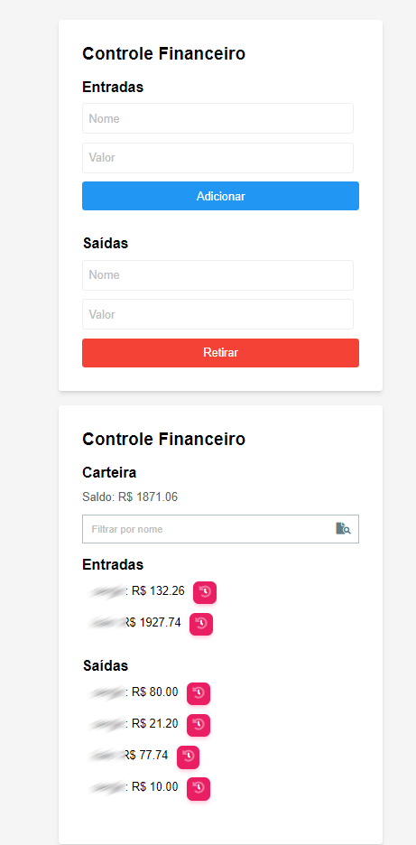
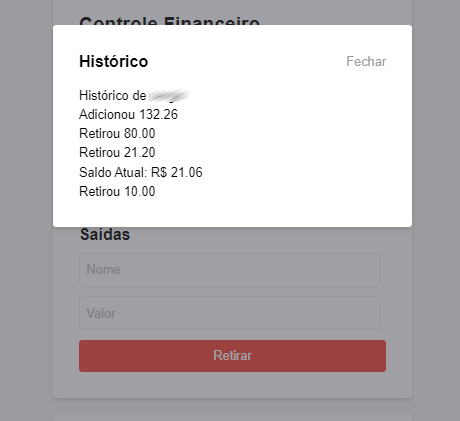

## PT-BR

# Controle Financeiro Pessoal - Trmx Financial Tracker

## Visão Geral
O Trmx Financial Tracker é um sistema robusto e fácil de usar para o gerenciamento de finanças pessoais, projetado para ajudá-lo a ter controle sobre suas atividades financeiras. Acompanhe suas entradas, saídas e saúde financeira geral com facilidade.

## Principais Recursos
- **Históricos Individuais:** Acompanhe as atividades financeiras de cada pessoa.
- **Entradas e Saídas:** Registre e categorize receitas e despesas.
- **Totais Individuais:** Veja a atividade financeira total de cada pessoa.
- **Saldo Consolidado:** Monitore o saldo financeiro coletivo de todas as pessoas.

## Como Utilizar
1. **Registros por Pessoa:** Registre transações para cada pessoa separadamente.
2. **Transações Categorizadas:** Diferencie entre receitas e despesas sem esforço.
3. **Resumos Individuais:** Consulte o resumo financeiro geral para cada pessoa.
4. **Balanço Unificado:** Visualize o saldo financeiro combinado de todas as pessoas.

## Tecnologias Utilizadas
- PHP para lógica do backend
- HTML5/Tailwind CSS para um frontend simples e intuitivo
- Json para armazenamento de dados

## Como Começar
1. Clone o repositório: `git clone https://github.com/Trmxv9/controle.git`
2. Navegue até o diretório do projeto: `cd controle`
3. Execute a aplicação: `Use servidor como: XAMPP`

Sinta-se à vontade para explorar, contribuir e personalizar este rastreador financeiro de acordo com suas necessidades!

## Licença
Este projeto é licenciado sob a Licença Trmx Codes - consulte o arquivo [LICENSE.md](LICENSE.md) para obter detalhes.

## EN 

# Personal Financial Control - Trmx Financial Tracker

## Overview
Trmx Financial Tracker is a powerful and user-friendly personal finance management system designed to help you take control of your financial activities. Keep track of your income, expenses, and overall financial health with ease.

## Key Features
- **Individual Histories:** Track financial activities on a per-person basis.
- **Income and Expenses:** Record and categorize income and expenses.
- **Individual Totals:** View the total financial activity for each person.
- **Combined Balance:** Monitor the collective financial balance of all individuals.

## How to Use
1. **Person-specific Entries:** Log transactions for each person separately.
2. **Categorized Transactions:** Differentiate between income and expenses effortlessly.
3. **Individual Summaries:** Check the overall financial summary for each person.
4. **Unified Balance:** View the combined financial balance for all individuals.

## Technologies Used
- PHP for backend logic
- HTML5/Tailwind CSS for a simple and intuitive frontend
- Json for data storage

## Getting Started
1. Clone the repository: `git clone https://github.com/Trmxv9/controle.git`
2. Navigate to the project directory: `cd controle`
3. Run the application: `Use server like: XAMPP`

Feel free to explore, contribute, and make this financial tracker your own!

## License
This project is licensed under the Trmx Codes License - see the [LICENSE.md](LICENSE.md) file for details.

